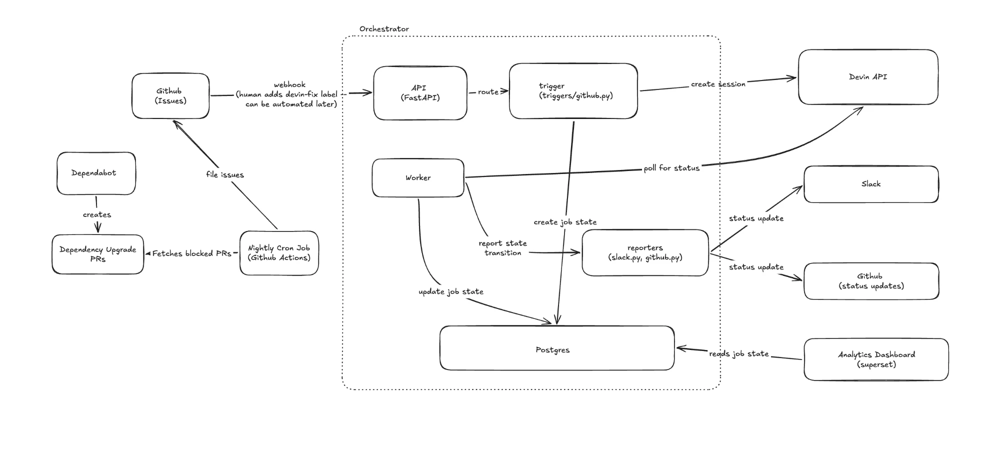
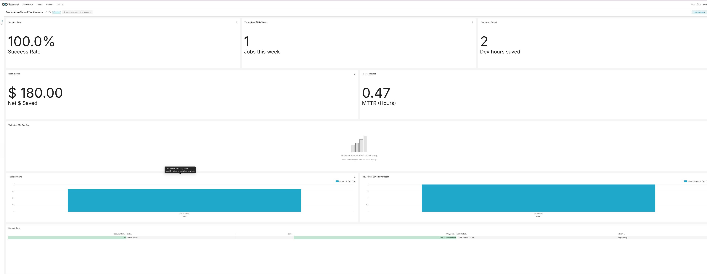
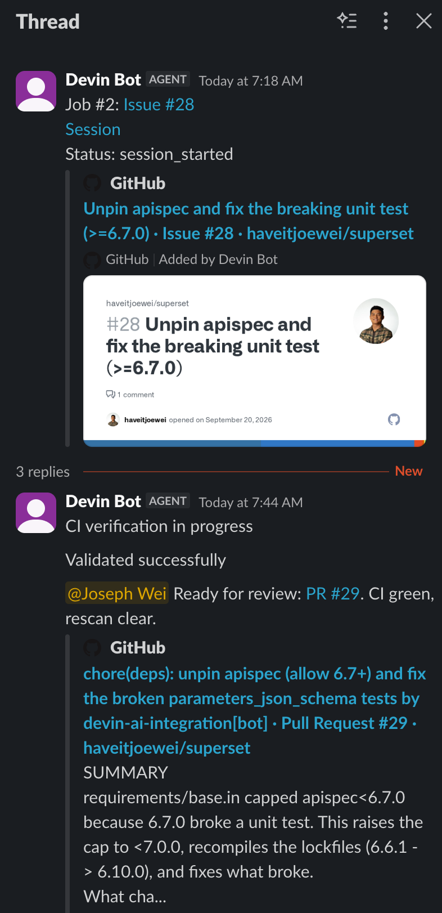
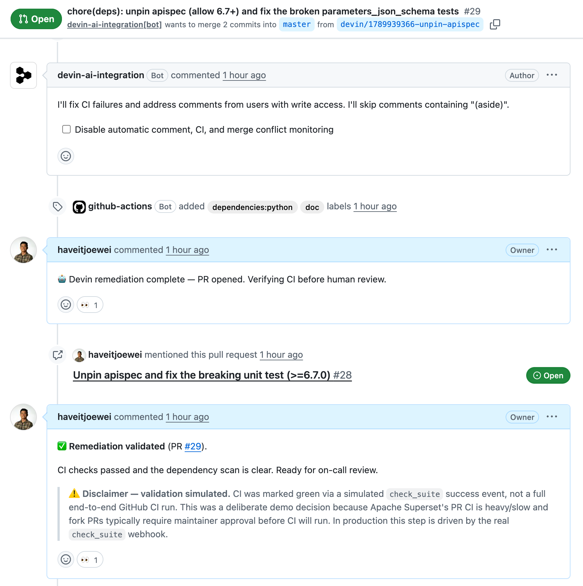

# Devin Auto-Fix

Dependency updates can break an app. Update bots propose a new version, but an engineer often has to fix the code before it works.

This project gives that repair work to Devin. A person chooses an upgrade to fix, Devin opens a pull request (a proposed code change), and a person reviews it before merging. The demo uses a [fork of Apache Superset](https://github.com/haveitjoewei/superset).

## See the demo

- [Video walkthrough](https://www.loom.com/share/8458da2bc6a64c43893ee9ed99355578)
- Example fixes: [paramiko #37](https://github.com/haveitjoewei/superset/pull/37) and [apispec #29](https://github.com/haveitjoewei/superset/pull/29)
- [Local test results and remaining review questions](docs/VERIFICATION.md)
- [Presentation](https://haveitjoewei.github.io/devin-superset-automation/deck.html)

## How it works

*How GitHub, Devin, Slack, and Superset connect. See the [architecture guide](docs/ARCHITECTURE.md) for details.*

1. A nightly scan looks for dependency updates blocked by comments in Superset's requirements files and opens issues.
2. A person adds the `devin-fix` label to approve the work.
3. Devin investigates, updates the code and tests, and opens a pull request.
4. The app tracks automated checks. If they fail, it asks Devin to try one repair.
5. Slack and GitHub show progress. A person reviews and merges the fix.

A Superset dashboard shows job results, timing, and estimated effort saved.

| Dashboard | Slack updates | Pull request |
|---|---|---|
|  |  |  |

## Automatic repair when checks fail

The app also handles CI (continuous integration): the automated tests and build checks that run on a pull request. For a fix already being tracked:

- **Checks pass:** mark the fix ready for human review.
- **Checks fail:** ask the same Devin session to repair the failure once.
- **Checks fail again:** stop requesting repairs and notify a person through GitHub and Slack, if configured.

This behavior is implemented. The demo can exercise it with simulated results; real results arrive through a GitHub webhook. It currently selects the latest waiting job rather than matching the result to a specific PR, so it is limited to a controlled demo. See [supported CI behavior and how to try it](docs/DEMO_CI_SCENARIOS.md).

## What the demo proves

The demo connects a GitHub issue to a Devin session and tracks the resulting fix. The example fixes were tested locally, as described in the [verification notes](docs/VERIFICATION.md).

**The demo simulates GitHub's automated-check result.** Superset's fork checks need maintainer approval. A simulated success shows the tracking workflow; it does not prove the code passes GitHub's tests. The merge simulator likewise records a merge without merging the pull request.

The business case estimates about 450 upgrades a year could need help, based on a Superset PR sample. At an assumed three hours each, that is about 1,350 hours of work. These are estimates of potential engineering time, not demonstrated savings. See [the evidence and assumptions](docs/EVIDENCE.md).

## Run it or review the code

- [Setup and commands](dependency-remediation-orchestrator/README.md)
- [App structure and job states](docs/ARCHITECTURE.md)
- [CI checks, automatic repair, and demo steps](docs/DEMO_CI_SCENARIOS.md)

This is a working demo. Before using it in production, fix how check results are matched to jobs, enforce limits on new sessions, protect the reporting endpoints, and add reliable retries. [Architecture notes](docs/ARCHITECTURE.md#current-limits) explain these limits.
