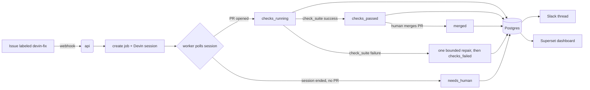

# Architecture

Event-driven system that turns a labeled GitHub issue into an autonomous
dependency-upgrade fix (a Devin session), tracks it to a validated PR, and
reports the whole lifecycle to Slack and a Superset dashboard.

## Components

| Component | Role |
|---|---|
| **api** (FastAPI) | Receives GitHub webhooks, verifies signatures, creates jobs + Devin sessions. Returns fast — never blocks on Devin. |
| **worker** (polling loop) | Polls active Devin sessions, advances job state, captures PR + cost. Respects a concurrency cap on *starting* jobs. |
| **Postgres** | Job store. Also the data source for the Superset dashboard (`vw_job_metrics` view). |
| **SlackReporter** | One thread per job; threaded updates on each transition; on-call @mention when checks pass. |
| **GitHubReporter** | Posts lifecycle status back to the issue and PR. |
| **Superset** | Leadership dashboard (success rate, throughput, dev-hours saved, MTTR) off `vw_job_metrics`. |

## Event flow

## Job lifecycle (state machine)

| State | Meaning |
|---|---|
| `queued` | job created, session not yet started |
| `fixing` | Devin session running |
| `checks_running` | PR opened, automated checks in flight |
| `checks_passed` | checks green — **ready for human review (not auto-merged)** |
| `merged` | a human merged the PR — the fix shipped (terminal success) |
| `checks_failed` | checks failed after one bounded repair attempt |
| `needs_human` | session ended without a PR, or an error — needs attention |

`checks_passed` is deliberately **not** called "validated": green checks are
evidence, not proof of correctness. Merges are always human-gated.

## Webhook handlers

- `issues.labeled` (label `devin-fix`) → create job + start Devin session.
- `check_suite.completed` → on failure, send **one** bounded repair message to the
  session; on success, mark `checks_passed`.
- `pull_request` (closed + merged) → mark `merged`.

The worker fills the gap between "session started" and "PR opened" by polling the
Devin API (PR arrives as `pull_requests[].pr_url`).

## Devin API usage (v3)

- Create session: `POST /v3/organizations/{org_id}/sessions`
- Poll status: `GET /v3/organizations/{org_id}/sessions/{id}`
- Bounded CI repair: `POST /v3/organizations/{org_id}/sessions/{id}/messages`
- Concurrency cap (default 2) limits concurrent session *starts*, never polling.

## Design decisions

- **Human-merge boundary.** The system never auto-merges. `checks_passed` pings
  on-call; a person merges. This matters for security-sensitive changes.
- **Simulated CI for the demo.** Apache Superset's PR CI is heavy/slow and fork
  PRs need maintainer approval before CI runs, so the demo drives the
  `check_suite` success event locally (`scripts/simulate_ci.py`). Production uses
  the real GitHub `check_suite` webhook. Every simulated validation is disclaimed
  in the PR comment.
- **One metrics source.** Slack, GitHub, the `/metrics` endpoint, and Superset all
  read the same Postgres `jobs` table / `vw_job_metrics` view — metrics are never
  computed twice.
