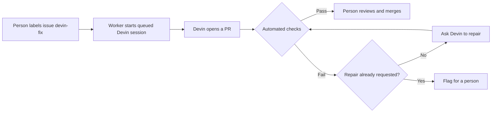

# How the app works

The app receives GitHub events, starts Devin repairs, and tracks each fix. People approve the work and merge the result.

## Components

| Component | Job |
|---|---|
| `api.py` | Check the webhook signature and route the event |
| `triggers/github.py` | Queue approved fixes and handle check results and merges |
| `worker.py` | Start queued sessions; poll Devin and reconcile GitHub checks |
| Postgres | Store jobs and provide `vw_job_metrics` for the dashboard |
| `reporters/` | Post updates to Slack and GitHub |
| Superset | Display results and timing from the database |

## Flow

A second check failure stops further automatic repair requests and asks for human attention. See [CI behavior and demo steps](DEMO_CI_SCENARIOS.md) for the supported outcomes. The app records progress in Postgres and posts updates to Slack and GitHub.

The nightly detector opens issues for blocked upgrades. It does not approve them or start repairs.

## Job states

| State | Meaning |
|---|---|
| `queued` | Job recorded; waiting to start |
| `starting` | Session creation in progress; an interrupted call needs inspection |
| `fixing` | Devin is working |
| `checks_running` | PR found; waiting for check results |
| `checks_passed` | Configured checks passed on the current commit; ready for human review |
| `merged` | A merge event was received |
| `checks_failed` | Checks failed after one repair, or the Devin session failed |
| `needs_human` | Session ended without a PR, or polling failed |

The demo can simulate check and merge events. These states alone do not prove that tests ran or a PR was merged. See [verification notes](VERIFICATION.md).

## Integrations

GitHub's issue-label event starts a fix. Check-suite results update its status, and a closed-and-merged PR event records the merge.

The Devin client uses the v3 organization API to create sessions, poll them, and send a follow-up message after a check failure. The worker reads the PR URL from the session response.

Other trigger sources would need new handlers. Automatically repairing failed Dependabot PRs is an idea described in the code, not an implemented feature.

## Current limits

- **One repository, one worker.** `TARGET_REPO` scopes incoming events. Jobs remain unique by issue number. The worker owns session creation and enforces `CONCURRENCY_CAP` before starting work.
- **Explicit verification policy.** `REQUIRED_CHECKS` names the GitHub Actions checks that must all succeed on the current PR commit. Empty, missing, or unfinished checks leave the job waiting. Classic commit statuses and automatic branch-protection discovery are not supported.
- **Bounded repair.** The app requests one repair. Repeated failures on the same commit count once; a failed replacement commit needs human attention. Disable Devin's separate automatic CI-repair integration for these PRs so it does not independently trigger repairs.
- **Usage is not a hard budget.** `ACU_ADMISSION_CAP` checks total recorded live ACUs before starting work. Existing and unreported consumption can exceed it. Legacy usage with unknown units is excluded.
- **Recovery is conservative.** Read failures retry on the next poll. An interrupted or uncertain session-creation call needs inspection in Devin before retrying. Reporting failures are logged without changing the job outcome; notification delivery has no durable retry queue.
- **Reporting endpoints are public.** Webhooks have signature checks; `/jobs` and `/metrics` have no authentication. Keep the service private or put authentication in front of it.
- **Demo and historical data.** Simulated outcomes and seeded rows are excluded from live reporting. Historical successes without a verified commit are counted as unverified, not successful. See [metric definitions](EVIDENCE.md#dashboard-figures).

The [original architecture image](images/architecture.png) is retained for the submitted walkthrough. Its Dependabot-PR discovery label predates the current requirements-comment scanner; the flow above describes the implementation.
