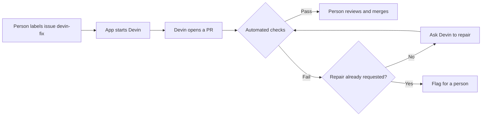

# How the app works

The app receives GitHub events, starts Devin repairs, and tracks each fix. People approve the work and merge the result.

## Components

| Component | Job |
|---|---|
| `api.py` | Check the webhook signature and route the event |
| `triggers/github.py` | Start fixes and handle check results and merges |
| `worker.py` | Poll Devin for progress, PR details, and usage |
| Postgres | Store jobs and provide `vw_job_metrics` for the dashboard |
| `reporters/` | Post updates to Slack and GitHub |
| Superset | Display results and timing from the database |

## Flow

A second check failure stops further automatic repair requests and asks for human attention. See [CI behavior and demo steps](DEMO_CI_SCENARIOS.md) for the supported outcomes. The app records progress in Postgres and posts updates to Slack and GitHub.

The nightly detector opens issues for blocked upgrades. It does not approve them or start repairs.

## Job states

| State | Meaning |
|---|---|
| `queued` | Job recorded; waiting to start |
| `fixing` | Devin is working |
| `checks_running` | PR found; waiting for check results |
| `checks_passed` | Checks reported success; ready for human review |
| `merged` | A merge event was received |
| `checks_failed` | Checks failed after one repair, or the Devin session failed |
| `needs_human` | Session ended without a PR, or polling failed |

The demo can simulate check and merge events. These states alone do not prove that tests ran or a PR was merged. See [verification notes](VERIFICATION.md).

## Integrations

GitHub's issue-label event starts a fix. Check-suite results update its status, and a closed-and-merged PR event records the merge.

The Devin client uses the v3 organization API to create sessions, poll them, and send a follow-up message after a check failure. The worker reads the PR URL from the session response.

Other trigger sources would need new handlers. Automatically repairing failed Dependabot PRs is an idea described in the code, not an implemented feature.

## Current limits

- **Check results match by PR number, not commit SHA.** A `check_suite` result resolves to the job that owns its PR, so concurrent jobs stay separate; matching on the head commit SHA as well would harden it against a re-run of an older commit.
- **Session limits are incomplete.** The worker checks `CONCURRENCY_CAP`, but the webhook starts sessions directly. The setting does not enforce a system-wide cap.
- **The spend guard uses recorded usage.** `DAILY_COST_CAP` blocks new work based on recorded usage for jobs created that day. It does not stop active sessions or guarantee a hard budget.
- **Reporting endpoints are public.** Webhooks have signature checks; `/jobs` and `/metrics` have no authentication.
- **Recovery is limited.** Failed API calls need reliable retries. Duplicate issues are checked by issue number, which is not enough for multiple repositories.
- **Savings are estimates.** The dashboard and API share job data, but calculate metrics separately. See [metric assumptions](EVIDENCE.md#dashboard-figures).
